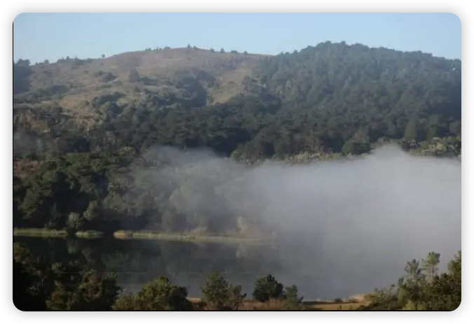

世界那么大 你要去看看
---

每一年，我们的高考寄语都不会直接谈考试本身，我们会跟大家一起畅想考试后悠长的假期，即将到来的大学生活，以及往后的人生路。今年也不例外，我们不妨就从考完试以后的假期讲起——你想好到时候要怎么度过了吗？

在我们当时，考试之后的日子里，撕书烧卷子，睡到自然醒，游戏随便玩，是不少同学的“常规操作”。像我自己因为是复读一年，倒没这么兴奋，很快就跟爸妈一起投入了估分和报志愿的焦虑中。

但是，我们那个时候更多的也都是“瞎玩”和“瞎忙”，跟现在很不一样。

我还记得，当时填报志愿，我是两眼一抹黑，完全不知道该怎么办的，只有眼前一本比复习资料厚一倍的目录可以翻。我爸没多想，就一个意见：一定要往北京考。考个地点在北京的学校，专业另想都行。实在进不去北京，就去北京边上。

我就依言去了“北京边上”，选了个天津的学校。

当时学校没有官微，网站提供的信息也极为有限。全家人只在官网看到红墙绿树的校园建筑，觉得还不错；要等真的去到了那边，才知道未来四年会被“发配”到完全不沾边的“新校区”。

请同学们不要着急——我们家填报志愿的忙碌焦虑，并没有换来比别的狂欢考生更好的结果。

极度缺乏信息，造成我们那一代的同学在高考后，有时候做的很多事情，后来发现也都是没什么太大意义的。这年代不提倡“笨鸟先飞”，因为方向错了的话，先飞也只是绕着窝打转转。

但是，我爸想到的这一条基本原则是对的：离开家乡，到北京去，到大城市去。

在我此后的生命中，我接触了形形色色的人们，他们来自全国和世界各地。只要是最后能在大城市站住脚的，不约而同地，都能想起亲朋好友对他们的催促和期望——走出大山，离开老家，到大城市去，到最热闹的地方去。

东北、西北、华北的人去北京。华东、西南的人去上海。华南的人去广州、香港。全国各地的打工仔，都往广州和深圳跑。这是多少年不断进化凝成的，普通人不用讲都能懂的生存哲学。

时至今日，18 岁已经不再是一个特别无知懵懂的年龄，小城市的人也没那么闭目塞听。

各大高校在高考季变着法子用微博和微信招徕新生，而在此之外的时间段，高校们也频繁出现在梨视频们发的社会新闻里。知乎、贴吧等地也挤满了等着传授经验的学长学姐。只要你愿意，你可以在还没去到某所学校之前，把它寝室厕所里的都市传说都打听得一清二楚。

时至今日，象牙塔褪去了神秘感，考上大学就拥有一切的神话早就不再被提起，人生是个什么样子，你可能早已被“剧透”到索然无味。

我们日夜接触到的信息无穷无尽，早早地给自己灌输了世界的“全部真相”，也可以让你总结出“复读机”、“真香”、“柠檬怪”等“人类的本质”。甚至连 10 岁小孩都知道——“90后很孤独的，没有老公没有钱没有房。”

看起来，我们似乎真的能足不出户，完成以前不得不亲身前往才能有的体验了。如果就要带一层滤镜看世界你就去暖说说、翻朋友圈，想接触“真实”就打开快手。各种各样不同层级的信息，应有尽有，你需要的只是动动手指。

——真的是这样吗？只是浅尝辄止地隔着屏幕去观察别人的生活，这样就足够了吗？

第一，如果只是这样而已，那么它很可能像你曾刷过的剧，翻过的微博一样，在你脑海中留不下任何曾经历过的真情实感。毕竟，你在读的是别人的故事。

每一次当我背起行囊，前往一个陌生地点的时候，都会尽力先查资料，看有什么好地方，有什么别人去的不多的，没被抖音打卡占领的地方。而我的每一次旅行，都是对自己以前所做功课的一次确认。事后每每想起，也会是一份满满的回忆。

你看，这包含了“预习——上课——复习”全流程的一堂课，对目的地的印象怎能不深？

第二，这样做还过度高估了人类头脑的理性程度。

在你果真要踏上旅途，前往一个陌生地方，去亲身体验屏幕中看到的东西时，计划是随时会变的，遇到的人和事都是完全随机的。

“世界那么大，我想去看看”，这是郑州一位女教师在 2015 年写的辞职信的全部内容。这位老师本来想着游遍全世界，结果万万没想到，在旅游的第一站就遇到了“真命天子”。在额外多走了国内几个城市之后，她就跟在大理认识的男友结婚，定居成都。

说好的环游世界呢？怕是再也不会有了，但这对那位老师而言，还重要吗？所以，你能亲自体验到的事情，可能跟光是看着视频幻想完全不同。

第三，你获得的个人经验，也不是可以完全转述出来的。

比如说，你回想一下你曾经亲自去过的某个景点或城市，现在要你写个游记或者拍 VLOG，你确定能把你所有想说的都完全说出来？更多时候，是同去的小伙伴说：“我们还吃了这个……逛了那个……”然后你才恍然大悟，“对对对，我刚才忘记加进去了”。

推己及人，你就能想到那些所有你看过的别人的故事，有什么问题了。就算没有经过刻意改编和美化，就算是架起直播，你看到的也未必是全部。

第四，旅途之后，你最终得出的，对你自己有重大意义的结论，别人可能完全不感兴趣；而你自己观察他人的时候，你感兴趣的地方，其实又很容易被人误导。

直播也是要运镜，也是要有个剧本的。真正只是“记录生活”的流水账，一般会在你快速的滑动中一闪而过，它们未经包装的粗粝，跟旁边那些精心雕琢过的视频片段相比黯然失色，不可能引起你太大的兴趣。

很多对外部世界的记载，都是有意而为，都是带着目的而来。奋力描绘北欧和南美的无尽风光，是为了让你报团旅游。描述放弃高薪回家开民宿的烟火气，是为了让你慕名入住。展示一个种菜干农活还能保养好双手的清流女子，是为了让你去她网店买东西。

即使是故意去寻找一些“丧文化”“毒鸡汤”的金句，恐怕也有自己的目的——为了先摧毁你对人生原本的向往，再通过寻求心理咨询重新建立信心。

我不知道，一个人要经历过多少事，走过多少路，才能在回首往事的时候，将千言万语总结成一句“烂大街”的话？这并不是你听到这句话觉得“啊好有道理啊”，并把它作为过两天就换掉的签名档，就能理解的。

比如说，我真正理解爸爸“到大城市去”的理念，以及今后爸妈为我做的很多事情，都要等到他们做那个决定大概十多年后。

在这段时间，我一直想从反面证明，不按照他们给定的道路也能活下去，也可以活得很好。时至今日，我去了世界上很多地方，也习惯于安顿在大城市——或曰城市“边上”。我觉得，自己跟爸妈，大概各有一半是对的吧。

我所坚持的地方，就是趁着年轻，多去体验截然不同的生活方式，多去感受不同人群的内心世界。
只要你这么做了，你一定会在未来某个时候，感受到触及灵魂深处的文化碰撞；而在那之后留下的，就是对不同意见，不同价值观的高度包容。

比如说，我没有去过非洲，但我对有一天在前往斯坦福大学的公路上，看到的峡谷云层一直记忆犹新。在这里，我摘录一下当时写的东西：

> 我们前往斯坦福时候，上路是清晨 8 点钟。上车时走在旧金山市内，还是无云的蓝天，出了城奔走在公路上，就变成细细白白的雾气氤氲。走着走着，一片我们从未看过的画卷喷薄而出，伸展在我们的面前。公路边上是货真价实的谷地，而峡谷当中是 “薄雾浓云”，大团大团的云朵像棉花糖一样在峡谷中翻滚。走了一段以后，山谷之上的天空恢复了湛蓝，峡谷中却依然是云海滚滚，对比鲜明。我们正经过的路边是一片平展的水库水面，而这提供了旧金山人们的生活用水。这虽非 “高峡出平湖”，但我们能透过云团，隐约看到镜面般平静的水面，似乎来到了神话传说中的天宫瑶池。这神奇的云海是我们同行大多数人平生第一次见到，除了新奇，就是彻底被击中一般的震撼，这是让我们感到此生无憾的时刻。谁能信誓旦旦地说，这曼妙的风景，从来不曾启发过乔布斯心中的禅思，让他在家门口也可以站在艺术与人文交集的十字路口？谁能够否认，这如诗如画的景观，让往来的创业者和产品经理们赏心悦目，在身心沉浸其中的状态下，更有利于培育那难得一见的灵感？

我拍的一幅图片放上去，可能跟“天空之镜”那种精修过的奇景照片相比，也没什么吸引力；但这幅简陋的照片，却可以让我完全理解，为什么会有人愿意过那个“间隔年”，愿意放着岁月静好的日子不过，前往看似动荡不安的世界边缘。

还记得数月前埃塞俄比亚航空的空难吗？罹难者里面有一个中国女孩，她原本打算跟男朋友一起去看长颈鹿。

只是因为她不是因公殉职的中资公司员工，不是联合国工作人员，只是为了满足她自己的好奇心，她居然就这么在网络舆论上，遭遇到人身攻击的无妄之灾。“家里有钱为什么要满世界炫耀”这样的已经算好听的了，比这更可怕的言论也到处都是。

我在想，这些人不也是天天通过手机看世界吗？全世界的“沙雕视频”他们都能看到，为什么还会出现“人类的悲欢并不相通”这种事？我想，最最根本的原因，是他们压根就没有亲自体验过，亲自感受过。

纸上得来终觉浅，绝知此事要躬行。你去了，你就知道。

当今世界，全球化带来的交流与合作的潮流，正受到严重的挑战，压力来自外面，更来自内部。
我可以确信一点，如果有人一直坚持着“独立自主”，动不动就“不玩了”，那么他并没有真正体会过，脱离外界自我循环需要付出多大的代价，而如果能尽力避免，又该是怎样的幸运。

我们真诚的希望大家，不管有钱没钱，在能力允许的范围内，都要多出去走一走，看一看。

希望大家不要把出门当成任务，把出国当成镀金，而是意在丰富阅历，感知不同思想，同时传递自己的主张。

正如阿拉伯地区广泛流传的格言：“求学问，哪怕远在中国”。我们在坚持中国形象和习俗的同时，也应该欣赏和兼容别人的审美，尊重别人的文明与思考。

即将成为社会新生力量的各位同学，我们对你们寄予厚望，你们是让中国继续以开放之姿，屹立于世界民族之林的希望。

世界那么大，希望你也可以去看看。

祝你接下来的考试一切顺利！加油！

---

LJ执笔
cnBeta.COM 编辑团队
2019.6.7

文章来源
https://www.cnbeta.com.tw/articles/tech/854881.htm